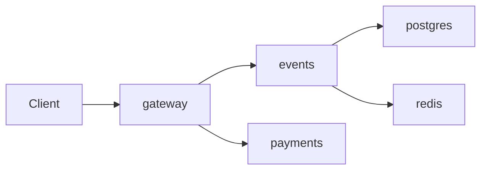

# Lab 1 — Deploy, Break, Understand

## Task 1 — Deploy & Break QuickTicket

### 1.1 Docker Compose status

```text
NAME             IMAGE                COMMAND                  SERVICE    CREATED          STATUS                    PORTS
app-events-1     app-events           "uvicorn main:app --…"   events     14 seconds ago   Up 8 seconds              0.0.0.0:8081->8081/tcp, [::]:8081->8081/tcp
app-gateway-1    app-gateway          "uvicorn main:app --…"   gateway    14 seconds ago   Up 8 seconds              0.0.0.0:3080->8080/tcp, [::]:3080->8080/tcp
app-payments-1   app-payments         "uvicorn main:app --…"   payments   14 seconds ago   Up 14 seconds             0.0.0.0:8082->8082/tcp, [::]:8082->8082/tcp
app-postgres-1   postgres:17-alpine   "docker-entrypoint.s…"   postgres   14 seconds ago   Up 14 seconds (healthy)   0.0.0.0:5432->5432/tcp, [::]:5432->5432/tcp
app-redis-1      redis:7-alpine       "docker-entrypoint.s…"   redis      14 seconds ago   Up 14 seconds (healthy)   0.0.0.0:6379->6379/tcp, [::]:6379->6379/tcp
```

### 1.2 Critical path output

List events:

```json
[
  {
    "id": 1,
    "name": "Go Conference 2026",
    "venue": "Main Hall A",
    "date": "2026-09-15T09:00:00+00:00",
    "total_tickets": 100,
    "price_cents": 5000,
    "available": 100
  },
  {
    "id": 4,
    "name": "Python Workshop",
    "venue": "Lab 301",
    "date": "2026-09-22T14:00:00+00:00",
    "total_tickets": 25,
    "price_cents": 2000,
    "available": 25
  },
  {
    "id": 2,
    "name": "SRE Meetup",
    "venue": "Room 204",
    "date": "2026-10-01T18:00:00+00:00",
    "total_tickets": 30,
    "price_cents": 0,
    "available": 30
  },
  {
    "id": 5,
    "name": "Kubernetes Deep Dive",
    "venue": "Auditorium B",
    "date": "2026-10-10T10:00:00+00:00",
    "total_tickets": 80,
    "price_cents": 8000,
    "available": 80
  },
  {
    "id": 3,
    "name": "Cloud Native Summit",
    "venue": "Expo Center",
    "date": "2026-11-20T10:00:00+00:00",
    "total_tickets": 500,
    "price_cents": 15000,
    "available": 500
  }
]
```

Reserve ticket:

```json
{
  "reservation_id": "08867fc2-53f0-45b9-9806-03081058474e",
  "event_id": 1,
  "quantity": 1,
  "total_cents": 5000,
  "expires_in_seconds": 300
}
```

Pay reservation:

```json
{
  "order_id": "08867fc2-53f0-45b9-9806-03081058474e",
  "event_id": 1,
  "quantity": 1,
  "total_cents": 5000,
  "status": "confirmed"
}
```

Healthy system:

```json
{
  "status": "healthy",
  "checks": {
    "events": "ok",
    "payments": "ok",
    "circuit_payments": "CLOSED"
  }
}
```

### 1.3 Dependency map



Dependencies:

```text
gateway -> events -> postgres
gateway -> events -> redis
gateway -> payments
```

### 1.4 Failure table

| Component Killed | Events List | Reserve | Pay | Health Check | User Impact |
|-----------------|-------------|---------|-----|--------------|-------------|
| payments | Works, HTTP 200 | Works, reservation created | Fails gracefully, HTTP 503 with `payments_unavailable` JSON | HTTP 503, `payments=down`, `events=ok` | Users can browse and reserve, but cannot complete payment until payments recovers. |
| events | Fails, HTTP 502 `Events service unavailable` | Fails, `Events service unavailable` | Skipped because no reservation can be created | HTTP 503, `events=down`, `payments=ok` | Core ticket browsing/reservation path is unavailable. |
| redis | Works, HTTP 200 | Fails with `Events service timeout` | Skipped because no reservation can be created | HTTP 503, gateway reports `events=down`, `payments=ok` | Event catalog is still readable from Postgres, but reservations fail because holds depend on Redis. |
| postgres | Fails, HTTP 502 `Events service unavailable` | Fails with `Internal Server Error` | Skipped because no reservation can be created | HTTP 503, `events=degraded`, `payments=ok` | Events service cannot read/write ticket data, so the main product path is broken. |

### 1.5 Load generator output

Normal run at 5 RPS:

```text
QuickTicket Load Generator
Target: http://localhost:3080 | RPS: 5 | Duration: 30s
---
[10s] requests=35 success=35 fail=0 error_rate=0%
[10s] requests=36 success=36 fail=0 error_rate=0%
[10s] requests=37 success=37 fail=0 error_rate=0%
[10s] requests=38 success=38 fail=0 error_rate=0%
[20s] requests=71 success=71 fail=0 error_rate=0%
[20s] requests=72 success=72 fail=0 error_rate=0%
[20s] requests=73 success=73 fail=0 error_rate=0%
[20s] requests=74 success=74 fail=0 error_rate=0%
---
Done. total=106 success=106 fail=0 error_rate=0%
```

Payments killed while load was running:

```text
QuickTicket Load Generator
Target: http://localhost:3080 | RPS: 5 | Duration: 30s
---
[10s] requests=36 success=36 fail=0 error_rate=0%
[10s] requests=37 success=37 fail=0 error_rate=0%
[10s] requests=38 success=38 fail=0 error_rate=0%
[20s] requests=73 success=70 fail=3 error_rate=4.1%
[20s] requests=74 success=71 fail=3 error_rate=4.0%
[20s] requests=75 success=72 fail=3 error_rate=4.0%
[20s] requests=76 success=73 fail=3 error_rate=3.9%
---
Done. total=110 success=104 fail=6 error_rate=5.4%
```

The failure rate increased from 0% to 5.4% after `payments` was stopped. Browsing and reservation requests still succeeded, while payment requests started failing with a clear 503 response.

## Task 2 — Graceful Degradation

### Gateway diff

```diff
diff --git a/app/gateway/main.py b/app/gateway/main.py
index c86db33..c3ffa3b 100644
--- a/app/gateway/main.py
+++ b/app/gateway/main.py
@@ -326,19 +326,33 @@ async def pay_reservation(reservation_id: str):
         resp.raise_for_status()
         return resp
 
+    def payments_unavailable_response():
+        return JSONResponse(
+            status_code=503,
+            content={
+                "error": "payments_unavailable",
+                "message": "Payment service is temporarily down. Your reservation is held — try again in a few minutes.",
+                "reservation_id": reservation_id,
+            },
+        )
+
     try:
         pay_resp = await payments_cb.call(lambda: call_with_retry(_charge, target="payments"))
         payment_ref = pay_resp.json().get("payment_ref", "unknown")
     except CircuitOpenError:
         log.error("circuit open, skipping payments call")
-        raise HTTPException(503, "Payment service temporarily unavailable (circuit open)")
+        return payments_unavailable_response()
     except httpx.TimeoutException:
-        raise HTTPException(504, "Payment service timeout")
+        log.error("payment service timeout")
+        return payments_unavailable_response()
     except httpx.HTTPStatusError as e:
         raise HTTPException(e.response.status_code, "Payment failed")
+    except httpx.TransportError as e:
+        log.error(f"payment transport error: {e}")
+        return payments_unavailable_response()
     except Exception as e:
         log.error(f"payment error: {e}")
-        raise HTTPException(502, "Payment service unavailable")
+        return payments_unavailable_response()
 
     # 2. Confirm reservation in events.
     try:
```

### Verification with payments down

Reserve still works:

```json
{
  "reservation_id": "a05169d6-fb03-4f0b-8527-e10cee0fbdfe",
  "event_id": 1,
  "quantity": 1,
  "total_cents": 5000,
  "expires_in_seconds": 300
}
```

Pay returns a clear 503:

```text
HTTP 503
{"error":"payments_unavailable","message":"Payment service is temporarily down. Your reservation is held — try again in a few minutes.","reservation_id":"a05169d6-fb03-4f0b-8527-e10cee0fbdfe"}
```

## Task 3 — GitHub Community

Starring repositories matters because it helps developers bookmark useful projects, gives maintainers a visible signal of interest, and makes good open-source work easier for others to discover. Following professors, TAs, and classmates helps track technical work over time, discover shared projects, and build professional relationships beyond a single course.

## Bonus Task — Resource Usage Under Load

### Baseline idle

```text
NAME             CPU %     MEM USAGE / LIMIT     NET I/O           PIDS
app-gateway-1    0.21%     34.63MiB / 1.913GiB   950B / 126B       1
app-events-1     0.16%     37.69MiB / 1.913GiB   3.32kB / 2.4kB    1
app-postgres-1   0.03%     21.71MiB / 1.913GiB   2.74kB / 2.34kB   8
app-redis-1      1.35%     3.523MiB / 1.913GiB   6.68kB / 2.6kB    6
app-payments-1   0.18%     33.31MiB / 1.913GiB   6.83kB / 1.8kB    2
```

### Under load

```text
NAME             CPU %     MEM USAGE / LIMIT     NET I/O           PIDS
app-gateway-1    2.56%     36.67MiB / 1.913GiB   440kB / 427kB     2
app-events-1     1.50%     39.34MiB / 1.913GiB   373kB / 509kB     2
app-postgres-1   0.51%     23.77MiB / 1.913GiB   209kB / 247kB     8
app-redis-1      1.27%     3.582MiB / 1.913GiB   57.9kB / 23.7kB   6
app-payments-1   0.10%     33.37MiB / 1.913GiB   4.3kB / 2.81kB    2
```

### Under stress with payment fault injection

```text
NAME             CPU %     MEM USAGE / LIMIT     NET I/O           PIDS
app-payments-1   0.56%     34.8MiB / 1.913GiB    4.56kB / 3.33kB   2
app-gateway-1    1.84%     36.8MiB / 1.913GiB    670kB / 650kB     2
app-events-1     0.91%     39.45MiB / 1.913GiB   572kB / 777kB     2
app-postgres-1   0.22%     23.77MiB / 1.913GiB   322kB / 375kB     8
app-redis-1      1.63%     3.59MiB / 1.913GiB    85kB / 34.9kB     6
```

10 RPS load result:

```text
Done. total=171 success=167 fail=4 error_rate=2.3%
```

Chaos result with `PAYMENT_FAILURE_RATE=0.3` and `PAYMENT_LATENCY_MS=500`:

```text
Done. total=143 success=121 fail=22 error_rate=15.3%
```

The events service used the most memory in all three captures: 37.69 MiB idle, 39.34 MiB under load, and 39.45 MiB during chaos. Under load, the gateway used the most CPU in the captured sample (2.56%) because every client request enters through it and it fans out to backend services. With injected payment latency/failures, gateway memory stayed roughly stable but network I/O increased because requests spent longer waiting on payments and more payment attempts failed.
