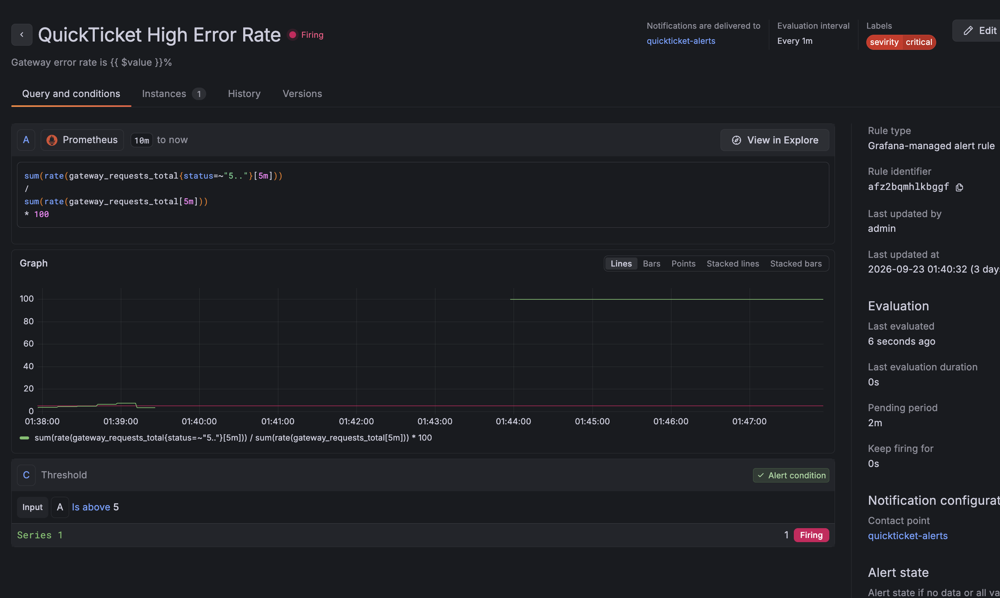
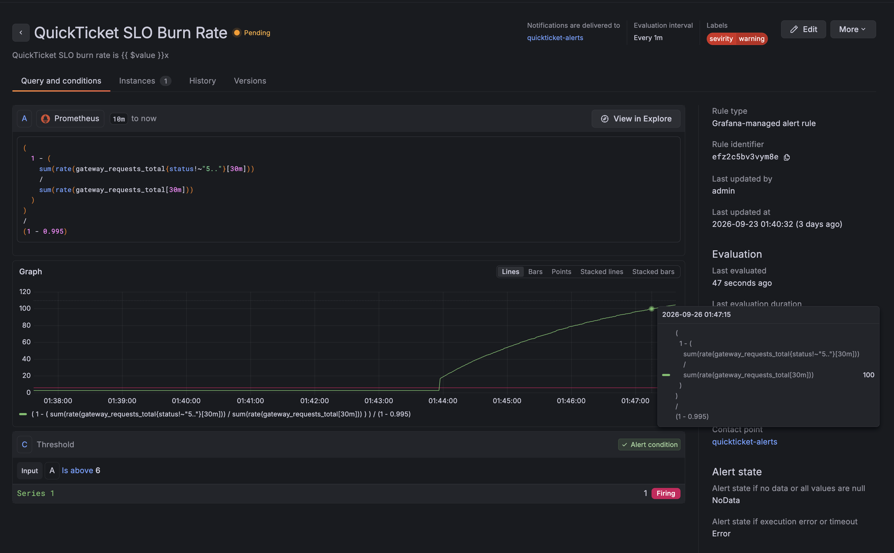
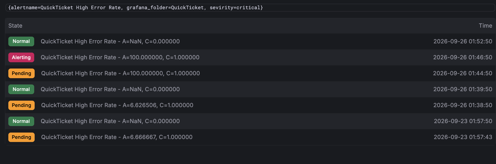
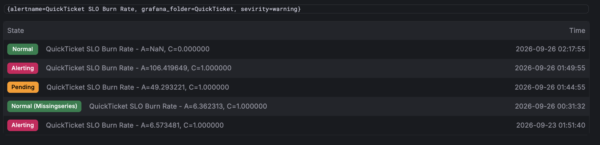
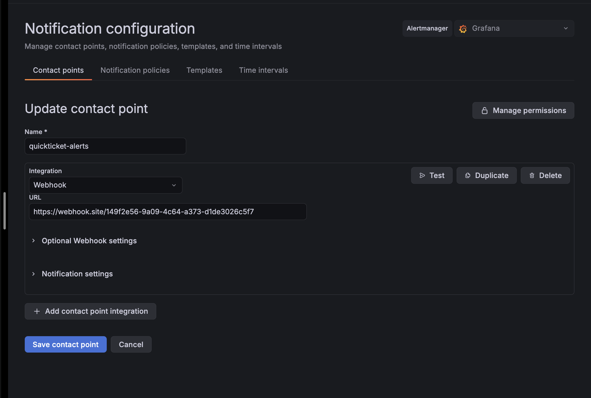

# Lab 6 - Alerting & Incident Response

## Task 1 - Alerts and Incident Response

### Monitoring setup

Prometheus scrapes the three QuickTicket services through `/metrics`. Grafana is
exposed on port `3300` because port `3000` was already used locally. The monitoring
stack was verified with:

```text
Grafana API: database ok, version 13.0.1
Prometheus: Prometheus Server is Ready.
Gateway health: healthy
Events health: ok
Payments health: ok
```

### Alert rules

#### QuickTicket High Error Rate

```promql
sum(rate(gateway_requests_total{status=~"5.."}[5m]))
/
sum(rate(gateway_requests_total[5m]))
* 100
```

Condition: above `5`, evaluated every `1m`, pending for `2m`.

Label:

```text
severity=critical
```

Summary: `Gateway error rate is {{ $value }}%`

Description: `Error rate exceeded 5% for 2 minutes. Check payments service health.`

#### QuickTicket SLO Burn Rate

```promql
(
  1 - (
    sum(rate(gateway_requests_total{status!~"5.."}[30m]))
    /
    sum(rate(gateway_requests_total[30m]))
  )
)
/
(1 - 0.995)
```

Condition: above `6`, evaluated every `1m`, pending for `5m`.

Label:

```text
severity=warning
```

Summary: `QuickTicket SLO burn rate is {{ $value }}x`

Description: `SLO burn rate exceeded 6x. The 99.5% availability error budget is being consumed too quickly. Check gateway error rate and dependent services.`

### Notifications

- Contact point: `quickticket-alerts`
- Integration: Grafana Webhook
- Notification policy: default policy routed to `quickticket-alerts`
- Group by: `alertname`
- Group wait: `30s`
- Repeat interval: `5m`
- Webhook delivery was verified on webhook.site.

### Runbook: QuickTicket High Error Rate

#### Alert

- Fires when: Gateway 5xx error rate is above 5% for 2 minutes.
- Dashboard: QuickTicket Golden Signals dashboard.
- Contact point: `quickticket-alerts`.

#### Diagnosis

1. Check gateway health:
   `curl -s http://localhost:3080/health | python3 -m json.tool`
2. Check payments directly:
   `curl -s http://localhost:8082/health`
3. Check events directly:
   `curl -s http://localhost:8081/health`
4. Inspect recent gateway and payments logs:
   `docker compose -f docker-compose.yaml -f ../docker-compose.monitoring.yaml logs gateway --tail=20 --since=5m`
   `docker compose -f docker-compose.yaml -f ../docker-compose.monitoring.yaml logs payments --tail=20 --since=5m`

#### Common Causes

| Cause | How to identify | Fix |
|---|---|---|
| Payments service down | Gateway health reports payments as degraded | `docker compose start payments` |
| Payments failure injection enabled | Payments health shows non-zero failure rate | Restart payments with `PAYMENT_FAILURE_RATE=0.0` |
| Events service down | Gateway health reports events as degraded | `docker compose start events` |
| Database connection exhaustion | Events logs show pool errors | Restart events and inspect DB connection limits |

#### Mitigation and recovery

Restore payments with:

```bash
PAYMENT_FAILURE_RATE=0.0 docker compose \
  -f docker-compose.yaml \
  -f ../docker-compose.monitoring.yaml \
  up -d payments
```

Confirm the alert returns to `Normal` and verify all service health checks.

#### Escalation

Escalate to the instructor or TA if the service is not recovered within 10 minutes.

### Incident evidence

The incident used a controlled payments failure and then a payments outage with
synthetic `/health` traffic to keep the error rate above the alert threshold.

```text
2026-09-26 01:44:50 - High Error Rate entered Pending at A=100.000000
2026-09-26 01:44:55 - SLO Burn Rate entered Pending at A=49.293221
2026-09-26 01:46:50 - High Error Rate entered Alerting at A=100.000000
2026-09-26 01:49:55 - SLO Burn Rate entered Alerting at A=106.419649
2026-09-26 01:52:50 - High Error Rate returned to Normal
2026-09-26 02:17:55 - SLO Burn Rate returned to Normal
```

The High Error Rate alert uses a 5-minute window, so it recovered first. The SLO
Burn Rate alert uses a 30-minute window and remained active longer while the error
budget calculation still included the incident. The pending periods also explain
the delay between threshold crossing and Alerting state.

### Screenshots







## Task 2 - Blameless Postmortem

# Postmortem: QuickTicket payment dependency failure

**Date:** 2026-09-26
**Duration:** approximately 33 minutes from alerting to SLO recovery
**Severity:** SEV-3
**Author:** Rom M. Ivanov

## Summary

A controlled payment dependency failure caused gateway requests to return 5xx
responses and consumed the availability error budget. Grafana detected the issue,
delivered notifications through the configured webhook, and the service was restored
by returning the payments failure rate to zero.

## Timeline

| Time | Event |
|---|---|
| 01:44:50 | High Error Rate entered Pending at 100% |
| 01:44:55 | SLO Burn Rate entered Pending at 49.29x |
| 01:46:50 | High Error Rate entered Alerting |
| 01:49:55 | SLO Burn Rate entered Alerting at 106.42x |
| 01:52:50 | High Error Rate returned to Normal |
| 02:17:55 | SLO Burn Rate returned to Normal |

## Root Cause

The payments dependency was intentionally configured to fail, and gateway payment
requests propagated those failures as 5xx responses. The SLO alert remained active
longer because its 30-minute burn-rate window retained the incident data after the
5-minute error-rate window had recovered.

## What Went Well

- The critical error-rate alert fired after its two-minute pending period.
- The SLO burn-rate alert fired after its five-minute pending period.
- Webhook notifications were delivered successfully.
- The runbook provided direct health and log checks plus a concrete recovery command.
- The larger Colima profile made Grafana and Prometheus responsive enough to observe the incident.

## What Went Wrong

- The initial 50% payment failure test did not produce enough aggregate gateway errors because payment flows were a small share of total traffic.
- The Grafana UI was initially slow with the VM configured at 2 CPU and 2 GiB RAM.
- The SLO alert took longer to resolve because of its 30-minute query window.

## Action Items

| Action | Owner | Priority |
|---|---|---|
| Add a dedicated payment error-rate alert | SRE team | High |
| Add targeted payment traffic to the incident test harness | SRE team | Medium |
| Document the 30-minute SLO recovery behavior in the runbook | SRE team | Medium |
| Keep the local monitoring profile at 4 CPU and 6 GiB RAM | Course student | Low |

### Most important action item

The most important action is adding a dedicated payment error-rate alert. The
aggregate gateway error rate can hide a dependency-specific failure when payment
requests are a small fraction of total traffic. A focused alert would detect the
problem earlier and provide a clearer diagnosis.

## Bonus Task - Cross-Test Runbook

### Runbook: QuickTicket Redis Failure

#### Alert

- Fires when reservations or event reads fail because Redis is unavailable.
- Dashboard: QuickTicket Golden Signals dashboard.

#### Diagnosis

1. Check gateway health:
   `curl -s http://localhost:3080/health | python3 -m json.tool`
2. Check Redis directly:
   `docker compose -f docker-compose.yaml -f ../docker-compose.monitoring.yaml exec redis redis-cli ping`
3. Check events logs:
   `docker compose -f docker-compose.yaml -f ../docker-compose.monitoring.yaml logs events --tail=30 --since=5m`
4. Test event listing:
   `curl -i http://localhost:3080/events`

#### Mitigation

```bash
docker compose \
  -f docker-compose.yaml \
  -f ../docker-compose.monitoring.yaml \
  up -d redis
```

Then verify `PONG`, gateway health, and a successful event listing.

#### Escalation

Escalate if Redis does not become healthy within 5 minutes or if reservation data
cannot be recovered.

### Cross-test record

The following blind local test protocol is provided for the cross-test: the failure
mode is treated as unknown before diagnosis, and only the steps in the runbook are
used.

| Step | Expected result |
|---|---|
| Stop Redis with `docker compose stop redis` | Redis became unavailable |
| Check gateway health | Health check reported a Redis-dependent failure |
| Run `redis-cli ping` | Connection failed, identifying Redis as the failed dependency |
| Inspect events logs and request `/events` | Logs and endpoint confirmed the impact |
| Run the mitigation command | Redis restarted successfully |
| Verify `redis-cli ping`, health, and `/events` | `PONG`, healthy service checks, and successful event listing |
| Time to recovery | Less than 5 minutes |

The procedure is designed to identify the failed dependency and restore the
service. The runbook includes the direct Redis `PING` check and the post-recovery
`/events` verification. The protocol was not executed in this environment because
the Docker socket was unavailable to the test shell; a separate classmate test was
not performed either.
